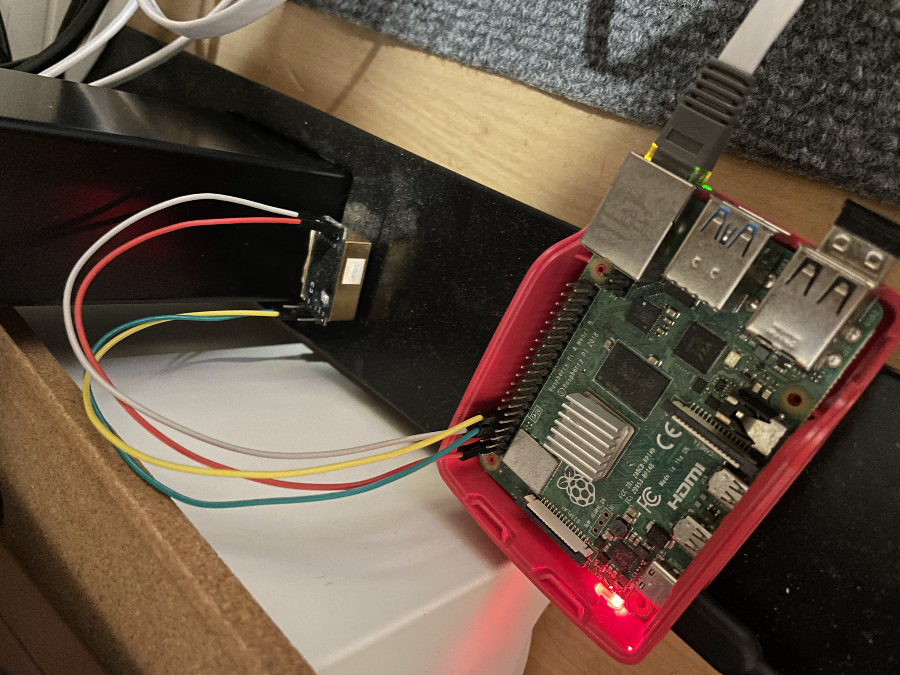

最近アウトプットが足りていないな、と思ってひそかに作っていたものを公開します。
昨今のコロナ禍で、その感染・拡大防止のためにオフィスの換気が重要であると言われています。
弊社でも、CO2モニターを購入しましたが、結局アラームに誰も気づかず換気し忘れるといった事態が多発しています。
そこでCO2濃度が基準値を超えたときにslackで換気を促す通知を送れば解決するのでは、と考えraspberry piとCO2濃度センサーを使って自作しました。

# 必要なもの
- raspberry pi
- CO2濃度センサー MH-Z19
  - 私はここで買いましたけど執筆当時は品切れ状態でした... https://amzn.asia/d/4bkBAfy

# センサーの動作確認
## raspberry piとMH-Z19を接続する
以下は raspiberry piのGPIOピン -> MH-Z19のピンと読みます
- 5V -> Vin
- GND -> Gnd
- GPIO 14 -> Vout
- GPIO 15 -> RXD


## プログラムで動作確認
1. mh-z19パッケージをインストールする
   ``` shell
   pip3 install mh-z19
   ```
2. 以下コマンドで動作確認する
   ``` shell
   sudo python3 -m mh_z14
   ```
現在のCO2濃度が表示されたら成功です。


# 実装
今回のプログラムは[taro0079/c02_monitor](https://github.com/taro0079/c02_monitor)にまとまっています。
## CO2濃度を表示させるプログラムの作成
``` python
import subprocess

out = subprocess.check_output([‘sudo’, ‘python3’, ‘-m’, ‘mh_z19’])
print(out)
```

これでいけます。
要はpythonでコマンドを叩いています。

## CO2濃度の基準値を超えたらSlack通知する
ネットで適当に調べると、コロナウイルス対策のためには、CO2濃度が1000 ppm以下に保つ必要があるとのことです。[二酸化炭素濃度が基準を超えるとどうなる？濃度が上がる意外な原因とは｜日本住環境株式会社](https://www.njkk.co.jp/blog/?itemid=81&dispmid=764)

slackのincoming webhookを使ってサクッと実装します
``` python
WEB_HOOK_URL = "https://hooks.slack.com/services/XXXXXXXX/XXXXXX/XXXXXXX"

requests.post(WEB_HOOK_URL, data = json.dumps({
    'text': u'CO2の濃度は'+ str(CO2_conce) + u' ppmです',
    'username': 'Mr. CO2 monitor',
    'icon_emoji': u':smile_cat:',
    'link_names': 1,
}))
```

slackのincome webhookについては[PythonでSlackのIncoming Webhookを試してみる - Qiita](https://qiita.com/bakira/items/8fa06ab10edf1f42ff97)を参考にしました。

# 動作確認
``` shell
python3 main.py
```
とファイルを実行する（これまでに作成したファイルをmain.pyとした場合）と、slackに現在のCO2濃度が通知されるはずです！

# cronで定期実行する
今のままだと`python3 main.py`とコマンドを叩かない限りCO2濃度が通知されないので、raspberry piで定期的に実行されるようにcronの設定をします。
まずは以下コマンドでcrontabを起動します。
``` shell
crontab -e
```
cronの書き方、設定方法は[Raspberry Piでcronを使ってPythonを定期実行する - Raspberry Pi & Python 開発ブログ ☆彡](https://www.raspberrypirulo.net/entry/cron)を参考にしました。
僕は5分ごとに実行したかったので
``` shell
*/5 * * * * python3 /home/taro/dev/c02_monitor/main.py
```
と設定しました。
設定後は
``` shell
sudo reboot now
```
でraspberry piを再起動した後に有効になると思います。

# おまけ
せっかくなので取得したCO2濃度をデータベースに保存しておきましょう（用途不明）！
ORMにSQLAlchemyを使います。インスコは
``` shell
pip3 install SQLAlchemy
pip3 install mysql-connector-python
```
でできます。
そのあとはいくつか設定がいりますが、[taro0079/c02_monitor](https://github.com/taro0079/c02_monitor)を見ていただければわかると思います。

# まとめ
働き始めてからなかなか時間が取れず、アウトプットが減ってしまっていました。
今回社内での需要があってこのようなものをサクッと作りましたが、やはりモノづくりは楽しいなあと思いましたね！
これからもどんどんモノづくりしていきたい。

# 参考サイト
- [Raspberry Pi 4とMH-Z19Bで二酸化炭素濃度を計測してみた | DevelopersIO](https://dev.classmethod.jp/articles/raspberry-pi-4-b-mh-z19b-co2/)
- [PythonでSlackのIncoming Webhookを試してみる - Qiita](https://qiita.com/bakira/items/8fa06ab10edf1f42ff97)
- [Raspberry Piでcronを使ってPythonを定期実行する - Raspberry Pi & Python 開発ブログ ☆彡](https://www.raspberrypirulo.net/entry/cron)
- [二酸化炭素濃度が基準を超えるとどうなる？濃度が上がる意外な原因とは｜日本住環境株式会社](https://www.njkk.co.jp/blog/?itemid=81&dispmid=764)
- [【Python】SQLAlchemyでMySQLに接続する - Qiita](https://qiita.com/curry__30/items/432a21426c02a68e77e8)
